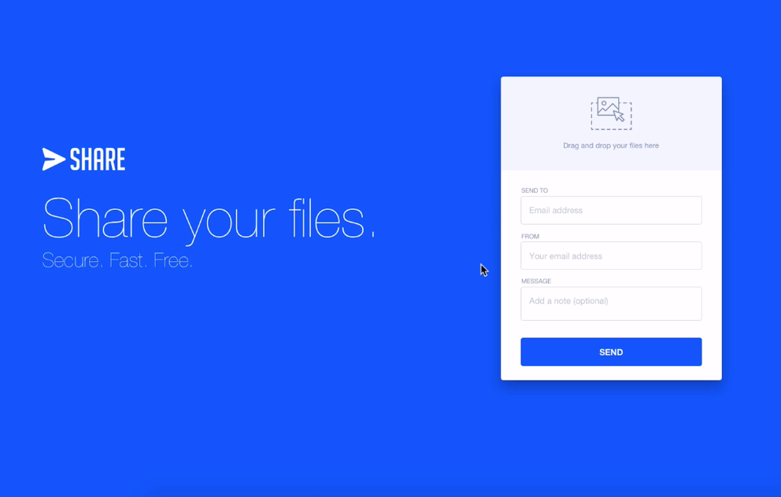

# File Sharing Web App with ReactJs, Nodejs,Mongob and AWS S3.

### Installation

```
git clone https://github.com/Princejhabak/file-sharing-app-react.js.git

```

```
cd fileapp/api

```
``` 
npm install 
```

### Development

``` npm run dev ```


## Start React App

``` 
cd app 

```

```
npm start
```

## Screenshots:



## Features:
  - Send files without any restrictions on the type of file to their inboxes as long as the total file size is under 25Mbs.
  - View files sent at the end, download them indivudially or altogether in the zip form.
  - Share zip of all files on social media.

## Techinal Details:
  - AWS S3 is used for storage.
  - Express.js is used for server script.
  - MongoDB is used as database hosted on mLab.
  - Bootstrap 4 and Sass is used for styling.
  - Best practices have been enforces and spaghetti code is avoided.
